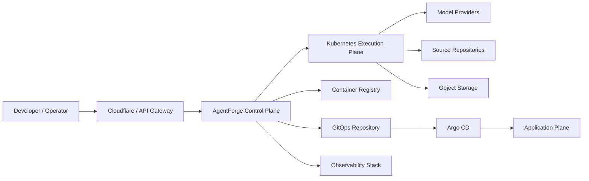

# System Context

## Trust boundaries

- Public edge to control plane.
- Control plane to execution clusters.
- Execution workloads to approved external systems.
- Control plane to deployment repository and application clusters.
- Tenant boundary across every persistence and authorization layer.
