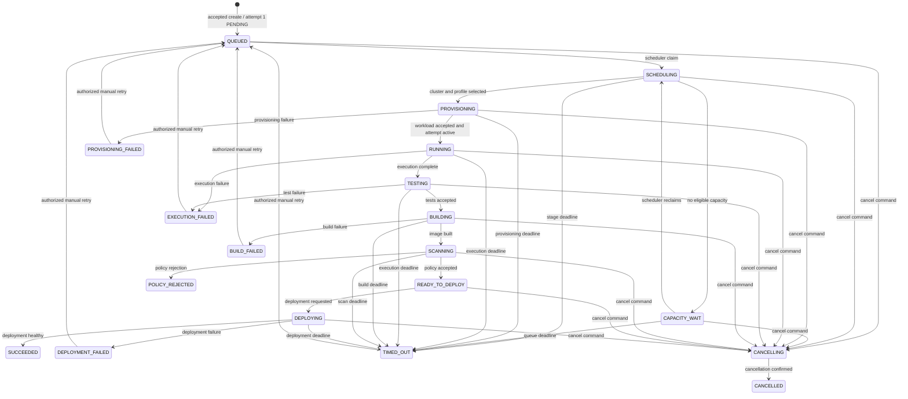
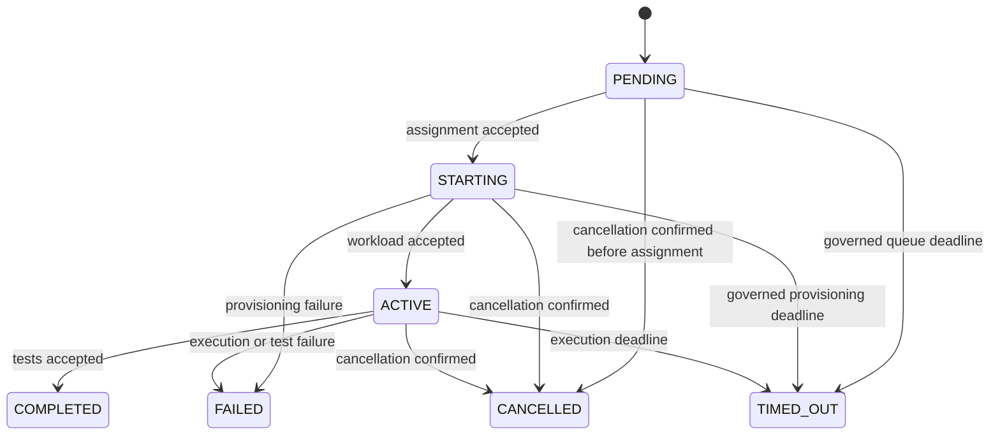

# State Machines

## AgentRun scope and invariants

`AgentRun` is the durable aggregate for one accepted request. Request parsing,
authorization, and validation happen before persistence; `REQUESTED` and
`VALIDATING` are therefore command-processing steps, not persisted statuses. A
successfully accepted run is created in `QUEUED` with attempt number `1` in
`PENDING`. No API accepts a client-supplied status.

Every transition changes the run version with a conditional update. An attempt
has its own version, but a transition that changes both records must validate
and update both in one transaction. The authoritative transition policy lives
in the domain aggregate; HTTP, Scheduler, and Operator adapters must not
reimplement it.

### Status groups

| Group | Statuses | Meaning |
|---|---|---|
| Waiting | `QUEUED`, `SCHEDULING`, `CAPACITY_WAIT` | The run has no active workload. `SCHEDULING` is lease-owned; `CAPACITY_WAIT` is visible backpressure. |
| Active workflow | `PROVISIONING`, `RUNNING`, `TESTING`, `BUILDING`, `SCANNING`, `READY_TO_DEPLOY`, `DEPLOYING` | A later Scheduler, Operator, Runner, or delivery service owns progress. |
| Cancellation | `CANCELLING` | Cancellation was durably accepted; the responsible future worker must converge it to `CANCELLED`. |
| Terminal | `SUCCEEDED`, `CANCELLED`, `PROVISIONING_FAILED`, `EXECUTION_FAILED`, `BUILD_FAILED`, `POLICY_REJECTED`, `DEPLOYMENT_FAILED`, `TIMED_OUT` | The outcome is stable, subject only to the explicit manual-retry exception below. |

`CAPACITY_WAIT` is required because capacity exhaustion is neither a failure nor
a hidden scheduler retry. `PROVISIONING_FAILED` distinguishes cluster or
workload admission failure from agent/test execution failure.

## AgentRun transition contract

The following table is exhaustive. Each listed integration event is an
immutable event intent with the run ID as partition key. Once the relevant
command is implemented, aggregate state, audit record, and event intent are one
PostgreSQL transaction. Phase 3.1/3.2 do not yet persist audit/outbox rows;
Phase 4 introduces the outbox and at-least-once delivery.

| Source | Target | Trigger and actor | Guards | Transactional side effects | Idempotency behaviour | Audit record | Integration event |
|---|---|---|---|---|---|---|---|
| absent | `QUEUED` | `CreateRun`, authorized Developer or Project Administrator | Tenant-derived identity can access project; effective request is valid; key is present | Insert run at version `1`, insert `PENDING` attempt `1`, retain only a secure prompt reference, persist tenant-scoped idempotency hash/result | Same tenant, key, and effective hash returns the original run; same key with another hash is `IDEMPOTENCY_KEY_REUSED` conflict; another tenant may reuse the key | `agent_run.created` with actor, project, run, command ID; never raw prompt | `agent-run.requested.v1` |
| `QUEUED` | `SCHEDULING` | Scheduler claim | Current attempt is `PENDING`; no cancellation; unexpired claim is absent | Persist lease owner/expiry and version; attempt remains pending | Repeated claim by the same unexpired owner is a no-op; competing claim receives version/lease conflict | `agent_run.scheduler_claimed` | None; a temporary lease is not a scheduled integration fact |
| `SCHEDULING` | `CAPACITY_WAIT` | Scheduler capacity decision | Claim is still owned; no eligible capacity | Clear lease, record bounded capacity reason and next eligibility | Repeated same decision is a no-op | `agent_run.capacity_waited` | `agent-run.capacity-wait.v1` |
| `CAPACITY_WAIT` | `SCHEDULING` | Scheduler reclaim | Eligible time reached and no cancellation | Persist fresh scheduler lease | Same-owner repeated reclaim is a no-op; competing claim conflicts | `agent_run.scheduler_claimed` | None; a temporary lease is not a scheduled integration fact |
| `SCHEDULING` | `PROVISIONING` | Scheduler assigns selected cluster/profile | Valid owned lease, policy, budget, and capacity still permit assignment | Persist immutable assignment and reservations for the attempt; clear claim lease; move attempt `PENDING` to `STARTING` | Replayed assignment with identical assignment is a no-op; different assignment conflicts | `agent_run.scheduled` | `agent-run.scheduled.v1`; `agent-run.provisioning-requested.v1` remains reserved until the Phase 6 boundary is approved |
| `PROVISIONING` | `RUNNING` | Operator reports workload accepted | Event belongs to the current attempt and aggregate version | Set attempt `ACTIVE` and execution start/deadline | Exact duplicate report is a no-op; stale attempt/version conflicts | `agent_run.started` | `agent-run.started.v1` |
| `RUNNING` | `TESTING` | Runner reports execution complete | Current attempt is active and result is successful | Persist execution result reference only; no raw source or prompt | Exact completion report is a no-op; a different terminal result conflicts | `agent_run.execution_completed` | `agent-run.execution-completed.v1` |
| `TESTING` | `BUILDING` | Test service accepts test result | Test result reference is accepted by policy | Persist accepted test-result reference and terminalize the current attempt as `COMPLETED` | Exact duplicate is a no-op; changed result conflicts | `agent_run.tests_accepted` | `agent-run.tests-accepted.v1` |
| `BUILDING` | `SCANNING` | Build service reports immutable image | Image digest is valid and immutable | Persist image digest/provenance reference | Same digest is a no-op; a different digest conflicts | `agent_run.build_completed` | `build.completed.v1` |
| `SCANNING` | `READY_TO_DEPLOY` | Policy service accepts scan | Scan/provenance references pass policy | Persist policy-decision reference | Same accepted decision is a no-op; changed decision conflicts | `agent_run.policy_accepted` | `policy.decision.v1` |
| `READY_TO_DEPLOY` | `DEPLOYING` | Deployment command/service | Deployment policy and authorization pass | Persist deployment request reference | Same command is a no-op; competing request conflicts | `agent_run.deployment_requested` | `deployment.requested.v1` |
| `DEPLOYING` | `SUCCEEDED` | Deployment service reports healthy rollout | Event is for current deployment and version | Set terminal completion timestamp | Exact duplicate is a no-op; alternate terminal outcome conflicts | `agent_run.succeeded` | `agent-run.completed.v1` |
| `PROVISIONING` | `PROVISIONING_FAILED` | Operator reports unrecoverable provisioning failure | Report belongs to current attempt and is not superseded by cancellation | Persist sanitized failure category/detail reference; terminalize attempt | Exact duplicate is a no-op; different outcome conflicts | `agent_run.provisioning_failed` | `agent-run.failed.v1` |
| `RUNNING` or `TESTING` | `EXECUTION_FAILED` | Runner or test service reports failure | Report belongs to current attempt and is not superseded by cancellation | Persist sanitized failure category/detail reference; terminalize attempt | Exact duplicate is a no-op; different outcome conflicts | `agent_run.execution_failed` | `agent-run.failed.v1` |
| `BUILDING` | `BUILD_FAILED` | Build service reports failure | Report belongs to current build/version | Persist sanitized failure category/detail reference | Exact duplicate is a no-op; different outcome conflicts | `agent_run.build_failed` | `agent-run.failed.v1` |
| `SCANNING` | `POLICY_REJECTED` | Policy service rejects scan | Rejection is for current scan/version | Persist policy decision reference and rejection class | Exact duplicate is a no-op; different decision conflicts | `agent_run.policy_rejected` | `agent-run.failed.v1` |
| `DEPLOYING` | `DEPLOYMENT_FAILED` | Deployment service reports terminal rollout failure | Report belongs to current deployment/version | Persist sanitized failure category/detail reference | Exact duplicate is a no-op; different outcome conflicts | `agent_run.deployment_failed` | `agent-run.failed.v1` |
| `SCHEDULING`, `CAPACITY_WAIT`, `PROVISIONING`, `RUNNING`, `TESTING`, `BUILDING`, `SCANNING`, or `DEPLOYING` | `TIMED_OUT` | Trusted stage deadline enforcer | The recorded deadline elapsed; command uses current version | Persist timeout stage and failure category; terminalize active attempt if applicable | Exact duplicate is a no-op; a late completion or failure conflicts | `agent_run.timed_out` | `agent-run.timed-out.v1` |
| Any nonterminal except `CANCELLING` | `CANCELLING` | `CancelRun`, authorized Developer or Project Administrator | Current state is cancellable; caller supplies a bounded reason | Persist cancellation reason, requester, request time, and command ID; signal the current attempt as cancellation requested | Repeated cancel in `CANCELLING` or `CANCELLED` returns the prior cancellation result; a non-cancelled terminal run returns `RUN_TERMINAL` conflict | `agent_run.cancellation_requested` | `agent-run.cancel-requested.v1` |
| `CANCELLING` | `CANCELLED` | Scheduler/Operator confirms there is no workload or cleanup remains | Confirmation is for current attempt/version; no terminal execution result won first | Terminalize unfinished current attempt as `CANCELLED`; persist completion time | Exact duplicate confirmation is a no-op | `agent_run.cancelled` | `agent-run.cancelled.v1` |
| Retryable terminal state | `QUEUED` | `RetryRun`, authorized Developer or Project Administrator | Failure category is explicitly retryable; `attempt_count < max_attempts`; no terminal override is required | Insert next monotonic `PENDING` attempt, clear transient assignment/failure fields, retain prior attempts and terminal history | Same retry command ID returns its queued result; a different retry after success conflicts | `agent_run.retry_requested` with source run status and new attempt number | `agent-run.retry-requested.v1` |

## Terminal, retry, and timeout semantics

All terminal statuses are immutable for ordinary commands and events.
`CANCELLED`, `SUCCEEDED`, and `POLICY_REJECTED` are never retryable. The only
documented exception is an authorized `RetryRun` transition from a terminal
failure whose recorded failure category is explicitly retryable and whose
maximum attempt limit has not been reached. That command creates the next
attempt on the same run and returns it to `QUEUED`; it never overwrites a prior
attempt or its outcome.

`PROVISIONING_FAILED`, `EXECUTION_FAILED`, `BUILD_FAILED`,
`DEPLOYMENT_FAILED`, and `TIMED_OUT` are retryable only when their recorded
category is `TRANSIENT_DEPENDENCY` or an approved transient infrastructure
class. Validation, authentication, authorization, quota, policy, permanent
dependency, execution/test failure, and invariant failure are non-retryable.
The API must not relabel a failed test or security-policy rejection as
transient. No Phase 3 override exists for permanent failures.

The submitted `timeoutSeconds` begins when the attempt becomes `RUNNING`; it
does not expire while the run is merely queued. Later services may define
separate bounded queue, provisioning, build, scan, and deployment deadlines;
each records its stage before it may transition to `TIMED_OUT`. Deadline events
are trusted internal commands, not client status mutations.

## Cancellation and completion races

Cancellation is a durable request, not a workload termination command. In
Phase 3 it must not contact Kubernetes. A future Scheduler removes queued
work, and a future Operator requests workload termination and confirms the
`CANCELLING -> CANCELLED` transition.

The first successfully committed conditional transition wins:

- If a completion or failure commits first, a concurrent cancellation reloads
  the terminal state and returns `RUN_TERMINAL`; it does not overwrite the
  outcome.
- If cancellation commits first, later completion/failure reports for the
  prior version are stale. They may be retained as diagnostic delivery records
  but cannot move the run out of `CANCELLING` or overwrite cancellation.
- Two simultaneous cancellation commands result in one `CANCELLING` update;
  the losing command reloads and returns the same cancellation result.

## Attempt state machine

An attempt is an immutable execution history entry except for its own lifecycle
fields. Attempt numbers begin at `1`, are unique per run, and are never reused,
including after cancellation or retry.

`COMPLETED`, `FAILED`, `CANCELLED`, and `TIMED_OUT` are terminal attempt
statuses. A later build, scan, or deployment failure is a run outcome and does
not reopen the completed execution attempt.

## Concurrency, duplicate commands, and recovery

- Every mutable run or attempt write uses `WHERE id = $id AND version =
  $expectedVersion`, increments the version, and maps zero affected rows to
  stable `VERSION_CONFLICT` after distinguishing a missing/foreign-tenant row.
  Callers may reload and reevaluate a command, but never blindly repeat a
  transition.
- Create requests use a tenant-scoped idempotency key and canonical effective
  request hash. Cancellation and retry use a stable command ID (the API accepts
  `Idempotency-Key`) so transport retries return the original result.
- State transition, attempt mutation, idempotency result, audit record, and
  outbox intent are one transaction once those command paths are implemented.
  No business transaction synchronously publishes to Kafka.
- After a process crash, PostgreSQL state is authoritative. Future Scheduler
  recovery reclaims expired `SCHEDULING` leases and reconciles incomplete
  provisioning; future Operator recovery observes the current run/attempt
  version before acting. No recovery path assumes in-memory command history.
